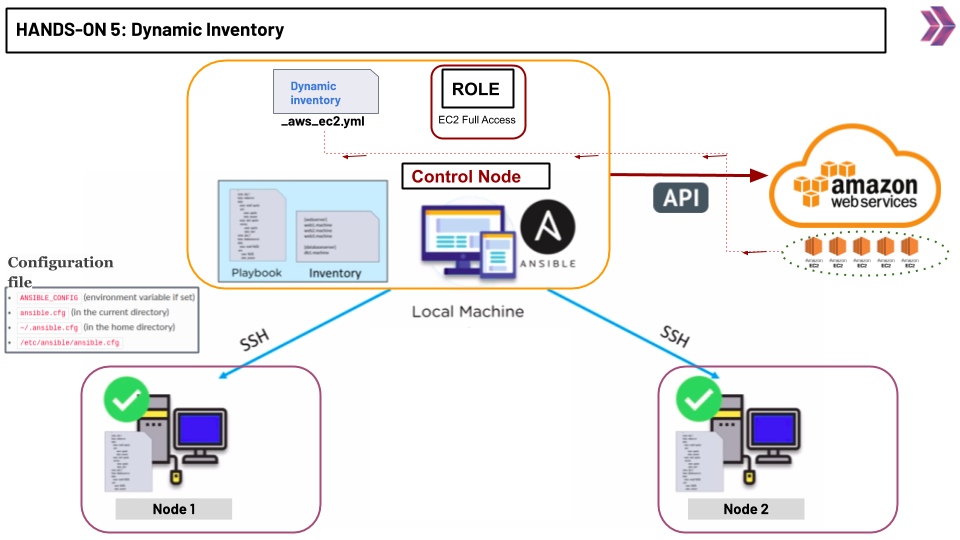

# Hands-on Ansible-03 : Using facts, vars, secrets and dynamic inventory

Purpose of the this hands-on training is to give students the knowledge of ansible facts gathering,  working with secret values and using dynamic inventory.

## Learning Outcomes

At the end of this hands-on training, students will be able to;

- Explain how and what facts gathering and how to use it in the playbook
- Learn how to deal with secret values with ansible-vault
- Explain what is dynamic inventory
- Explain how to use dynamic inventory with EC2 plugin.

## Outline

- Part 1 - Install Ansible

- Part 2 - Ansible Facts

- Part 3 - Working with sensitive data

- Part 4 - Working with dynamic inventory

## Part 1 - Install Ansible


- Spin-up 3 Amazon Linux 2023 instances and name them as:
    1. control node
    2. node1 ----> (SSH PORT 22, HTTP PORT 80)
    3. node2 ----> (SSH PORT 22, HTTP PORT 80)


- Connect to the control node via SSH and run the following commands.

```bash
sudo dnf update -y
sudo dnf install ansible -y
```

### Confirm Installation

- To confirm the successful installation of Ansible, run the following command.

```bash
ansible --version
```

### Configure Ansible on the Control Node

- Connect to the control node and create an inventory.

```bash
vim inventory.ini
```
```bash
[webservers]
node1 ansible_host=<node1_ip> ansible_user=ec2-user

[dbservers]
node2 ansible_host=<node2_ip> ansible_user=ec2-user

[all:vars]
ansible_ssh_private_key_file=/home/ec2-user/<pem file>
```

- Create an  `ansible.cfg` file under `/home/ec2-user` folder as below. 

```bash
vim ansible.cfg
[defaults]
host_key_checking = False
inventory = inventory.ini
deprecation_warnings=False
interpreter_python=auto_silent
``` 

- Copy your pem file to the /home/ec2-user directory. First, go to your pem file directory on your local PC and run the following command.

```bash
scp -i <pem file> <pem file> ec2-user@<public DNS name of Control Node>:/home/ec2-user
```

- or you can create a file name <pem file> into the directory `/home/ec2-user` on the control node and copy your pem file into it.

```bash
chmod 400 <pem file>
```

```bash
ansible all -m ping -o
```

## Part 2 - Ansible Variables and Facts

- While automation exists to make it easier to make things repeatable, all of your systems are likely not exactly alike.

- On some systems you may want to set some behavior or configuration that is slightly different from others.

- You might have some templates for configuration files that are mostly the same, but slightly different based on those variables.

- Variables in Ansible are how we deal with differences between systems.

- Create a playbook named `myplaybook.yml` as below.

```yaml
- name: Copy ip address to node1
  hosts: node1
  tasks:
   - name: Copy ip address to the nodes
     ansible.builtin.copy:
       content: 'Private ip address of this node is 172.31.88.207'
       dest: /home/ec2-user/myfile
      
- name: Copy ip address to node2
  hosts: node2
  tasks:
   - name: Copy ip address to the nodes
     ansible.builtin.copy:
       content: 'Private ip address of this node is 172.31.81.197'
       dest: /home/ec2-user/myfile
```

- Execute the playbook.

```bash
ansible-playbook myplaybook.yml
```

- Notice that in the playbook we use same content for each of node but ip address. This time we get the ip address value from a variable. Update the myplaybook.yaml as follow.

```yaml
- name: Copy ip address to node1
  hosts: node1
  vars:
    ip_address: 172.31.88.207
  tasks:
   - name: Copy ip address to the nodes
     ansible.builtin.copy:
       content: 'Private ip address of this node is {{ ip_address }}'
       dest: /home/ec2-user/myfile
      
- name: Copy ip address to node2
  hosts: node2
  vars:
    ip_address: 172.31.81.197
  tasks:
   - name: Copy ip address to the nodes
     ansible.builtin.copy:
       content: 'Private ip address of this node is {{ ip_address }}'
       dest: /home/ec2-user/myfile
```

- Execute the playbook and see that nothing changed.

```bash
ansible-playbook myplaybook.yml
```

### Ansible Debug Module

- This module prints statements during execution and can be useful for debugging variables or expressions without necessarily halting the playbook.

Update the myplaybook.yaml as follow.

```yaml
- name: Copy ip address to node1
  hosts: node1
  vars:
    ip_address: 172.31.88.207
  tasks:
   - name: Copy ip address to the nodes
     ansible.builtin.copy:
       content: 'Private ip address of this node is {{ ip_address }}'
       dest: /home/ec2-user/myfile
      
   - name: using debug module
     ansible.builtin.debug:
       var: ip_address

```

- Execute the playbook and check the output.

```bash
ansible-playbook myplaybook.yml
```

### Ansible facts

- Ansible facts are data related to your remote systems, including operating systems, IP addresses, attached filesystems, and more. You can access this data in the ansible_facts variable.

- Gathering Facts:

```bash
ansible node1 -m setup
```
```
ec2-34-201-69-79.compute-1.amazonaws.com | SUCCESS => {
    "ansible_facts": {
        "ansible_all_ipv4_addresses": [
            "172.31.20.246"
        ],
        "ansible_all_ipv6_addresses": [
            "fe80::88c:37ff:fe8f:3b71"
        ],
        "ansible_apparmor": {
            "status": "disabled"
        },
        "ansible_architecture": "x86_64",
        "ansible_bios_date": "08/24/2006",
        "ansible_bios_vendor": "Xen",
        "ansible_bios_version": "4.2.amazon",
        "ansible_board_asset_tag": "NA",
        "ansible_board_name": "NA",
        "ansible_board_serial": "NA",
```
- create a playbook named ``facts.yml``

```yml
- name: show facts
  hosts: all
  tasks:
    - name: print facts
      ansible.builtin.debug:
        var: ansible_facts
```
- run the play book

```bash
ansible-playbook facts.yml
```

- create a playbook named ``ipaddress.yml``

```yml
- hosts: all
  tasks:
  - name: show IP address
    ansible.builtin.debug:
      msg: >
       This host uses IP address {{ ansible_facts.default_ipv4.address }}

      # Alternative:
      # This host uses IP address {{ ansible_facts['default_ipv4']['address'] }}
```

- run the playbook

```bash
ansible-playbook ipaddress.yml 
```

## Part 3 - Working with sensitive data

### Using vars_files

- Create a file named `myuser.yml` as below.

```yaml
username: john
password: 123qwe
```

- Create a file named `create-user.yml` as below.

```yaml
- name: create a user
  hosts: all
  become: true
  vars_files:
    - myuser.yml
  tasks:
    - name: creating user
      ansible.builtin.user:
        name: "{{ username }}"
        password: "{{ password }}"
```

- run the plaaybook

```bash
ansible-playbook create-user.yml
```

- To verrify it

```bash
ansible all -b -m command -a "grep john /etc/shadow"
```

### Using encrypted files

- Create encypted file using ``ansible-vault`` command

```bash
ansible-vault create secret.yml
```

New Vault password: xxxx
Confirm Nev Vault password: xxxx

```yml
username: tyler
password: 99abcd
```

- look at the content

```bash
cat secret.yml
```
```
33663233353162643530353634323061613431366332373334373066353263353864643630656338
6165373734333563393162333762386132333665353863610a303130346362343038646139613632
62633438623265656330326435646366363137373333613463313138333765366466663934646436
3833386437376337650a636339313535323264626365303031366534363039383935333133306264
61303433636266636331633734626336643466643735623135633361656131316463
```
- how to use it:

- Update the `create-user.yml` file as below.

```yml
- name: create a user
  hosts: all
  become: true
  vars_files:
    - secret.yml
  tasks:
    - name: creating user
      ansible.builtin.user:
        name: "{{ username }}"
        password: "{{ password }}"
```

- run the plaaybook

```bash
ansible-playbook create-user.yml
```

```bash
ERROR! Attempting to decrypt but no vault secrets found
```

- Run the playbook with ``--ask-vault-pass`` command:

```bash
ansible-playbook --ask-vault-pass create-user.yml
```
Vault password: xxxx

```
PLAY RECAP ******************************************************************************************
node1                      : ok=2    changed=1    unreachable=0    failed=0    skipped=0    rescued=0    ignored=0   
node2                      : ok=2    changed=1    unreachable=0    failed=0    skipped=0    rescued=0    ignored=0   
```

- Verify it. This is same process. We just encrypted the variable file.

```bash
ansible all -b -m command -a "grep tyler /etc/shadow"
```
```
node1 | CHANGED | rc=0 >>
tyler:99abcd:18569:0:99999:7:::
```

- Create another encypted file using "ansible-vault" command but this time use SHA (Secure Hash Algorithm) for your password:

```bash
ansible-vault create secret-1.yml
```

New Vault password: xxxx
Confirm Nev Vault password: xxxx

```yml
username: Oliver
password: 14abcd
```

- look at the content

```bash
cat secret-1.yml
```
```
33663233353162643530353634323061613431366332373334373066353263353864643630656338
6165373734333563393162333762386132333665353863610a303130346362343038646139613632
62633438623265656330326435646366363137373333613463313138333765366466663934646436
3833386437376337650a636339313535323264626365303031366534363039383935333133306264
61303433636266636331633734626336643466643735623135633361656131316463
```
- how to use it:

- create a file named `create-user-1.yml` as below.

```yml
- name: create a user
  hosts: all
  become: true
  vars_files:
    - secret-1.yml
  tasks:
    - name: creating user
      ansible.builtin.user:
        name: "{{ username }}"
        password: "{{ password | password_hash ('sha512') }}"
``` 

- run the playbook


```bash
ansible-playbook --ask-vault-pass create-user-1.yml
```
Vault password: xxxx

```
PLAY RECAP ******************************************************************************************
node1                      : ok=2    changed=1    unreachable=0    failed=0    skipped=0    rescued=0    ignored=0   
node2                      : ok=2    changed=1    unreachable=0    failed=0    skipped=0    rescued=0    ignored=0   
```

- to verrify it:

```bash
ansible all -b -m command -a "grep Oliver /etc/shadow"
```
```
node1 | CHANGED | rc=0 >>
tyler:#665fffgkg6&fkg689##2£6466?%^^+&%+:18569:0:99999:7:::
```

# Part 4 - Working with Dynamic Inventory Using EC2 Plugin



### Pinging the Target Nodes with static inventory


- Make a directory named ```dynamic-inventory``` under the home directory and cd into it.

```bash 
mkdir dynamic-inventory
cd dynamic-inventory
```

- Create a file named ```inventory.ini``` with the command below.

```bash
nano inventory.ini
```

- Paste the content below into the inventory.ini file.

- Along with the hands-on, public or private IPs can be used.

```ini
[servers]
db_server   ansible_host=<YOUR-DB-SERVER-IP>   ansible_user=ec2-user  ansible_ssh_private_key_file=~/<YOUR-PEM-FILE>
web_server  ansible_host=<YOUR-WEB-SERVER-IP>  ansible_user=ec2-user  ansible_ssh_private_key_file=~/<YOUR-PEM-FILE>
```

- Create file named ```ansible.cfg``` under the the ```dynamic-inventory``` directory.

```bash
nano ansible.cfg
```

```cfg
[defaults]
host_key_checking = False
inventory=/home/ec2-user/dynamic-inventory/inventory.ini
interpreter_python=auto_silent
private_key_file=~/<pem file>
```

- Create a file named ```ping-playbook.yml``` and paste the content below.

```bash
nano ping-playbook.yml
```

```yml
- name: ping them all
  hosts: all
  tasks:
    - name: pinging
      ansible.builtin.ping:
```

- Run the command below for pinging the servers.

```bash
ansible-playbook ping-playbook.yml
```

### Working with dynamic inventory

- go to AWS Management Consol and select the IAM roles:

- click the  "create role" then create a role with "AmazonEC2FullAccess"

- go to EC2 instance Dashboard, and select the control-node instance

- select actions -> security -> modify IAM role

- select the role thay you have jsut created for EC2 full access and save it.

- install "boto3 and botocore"

```bash
sudo dnf install pip
pip install --user boto3 botocore
```

- Create another file named ```inventory_aws_ec2.yml``` in the project directory. 
(Note: The inventory file is a YAML configuration file and must end with aws_ec2.{yml|yaml}. Example: my_inventory.aws_ec2.yml.)

```bash
nano inventory_aws_ec2.yml
```

```yml
plugin: aws_ec2
regions:
  - "us-east-1"
keyed_groups:
  - key: tags.Name
compose:
  ansible_host: public_ip_address
```
- see the inventory

```bash
ansible-inventory -i inventory_aws_ec2.yml --graph
```

```
@all:
  |--@aws_ec2:
  |  |--ec2-34-201-69-79.compute-1.amazonaws.com
  |  |--ec2-54-234-17-41.compute-1.amazonaws.com
  |--@ungrouped:
```
- Change the inventory's value in ansible.cfg file to `inventory.ini`. `inventory=/home/ec2-user/dynamic-inventory/inventory_aws_ec2.yml`


- To make sure that all our hosts are reachable with dynamic inventory, we will run various ad-hoc commands that use the ping module.

```bash
ansible all -m ping --key-file "~/<pem file>"
```

- create a playbook name `user.yml`.

```yml
---
- name: create a user using a variable
  hosts: all
  become: true
  vars:
    user: lisa
    ansible_ssh_private_key_file: "/home/ec2-user/<pem file>"
  tasks:
    - name: create a user {{ user }}
      ansible.builtin.user:
        name: "{{ user }}"
```
- run the playbook

```bash
ansible-playbook user.yml -i inventory_aws_ec2.yml
```

```bash
ansible all -a "tail -2 /etc/passwd"
```

# Optional: Using AWS Parameter Store for passwords

- Create a role for `AWS Systems Manager`. (Select `EC2 Role for AWS Systems Manage` as Use case)

- Attach the role to the control node.

- Create a file named `vault_passwd.sh`.

```sh
123456
```

- Create encypted file using "ansible-vault" command. Use `123456` as password.

```bash
ansible-vault create secret-2.yml
```

New Vault password: xxxx
Confirm Nev Vault password: xxxx

```yml
username: alex
password: qaz321
```

- create a file named `create-user-2.yml` as below.

```yml
- name: create a user
  hosts: all
  become: true
  vars_files:
    - secret-2.yml
  tasks:
    - name: creating user
      ansible.builtin.user:
        name: "{{ username }}"
        password: "{{ password | password_hash ('sha512') }}"
``` 

- Run the playbook. This time we will use `--vault-password-file` option.


```bash
ansible-playbook create-user-2.yml --vault-password-file ./vault_passwd.sh
```

- to verrify it:

```bash
ansible all -b -m command -a "grep alex /etc/shadow"
```

- This time our vault password is in a file at plain text. So it is a security problem. We can use third party applications like `AWS Parameter Store`.


- Create a parameter named `ans-vault_passwd` at AWS Parameter Store. Input `123456` as value.

- Modify the `vault_passwd.sh` file as below.

```sh
#!/bin/bash
aws --region=us-east-1 ssm get-parameters --names "ans-vault_passwd" --query "Parameters[*].{Value:Value}" --output text
```

- Make the script executable.

```bash
chmod +x vault_passwd.sh
```

- Check the secret.

```bash
ansible-vault view secret-2.yml --vault-password-file ./vault_passwd.sh
```
