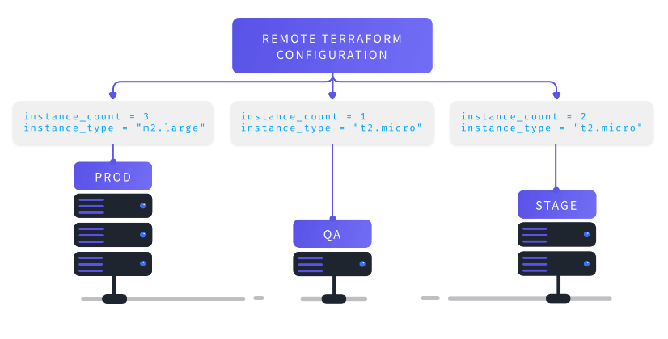

# Hands-on Terragrunt : Terragrunt Basic Operations:

Purpose of this hands-on training is to give students the knowledge of basic operations in Terragrunt.

## Learning Outcomes

At the end of this hands-on training, students will be able to;

- Build AWS Infrastructure with Terraform and Terragrunt

## Outline

- Part 1 - Install Terraform and Terragrunt

- Part 2 - Build AWS Infrastructure with Terraform and Terragrunt

## Part 1 - Create an EC2 instance with installed terraform and terragrunt 

- Launch an EC2 instance (`Amazon Linux 2023 AMI with security group allowing SSH connections and installed terraform and terragrunt`) using the terraform files in your github repository.

- Connect to your instance with SSH.

```bash
ssh -i .ssh/clarusway.pem ec2-user@ec2-3-133-106-98.us-east-2.compute.amazonaws.com
```

- Verify that the installations.

```bash
terraform --version
terragrunt --version
```
- list Terragrunt's available subcommands.

```bash
terragrunt -help
```

- Add any subcommand to terragrunt -help to learn more about what it does and available options.

```bash
terragrunt apply -help
```

## Part 2 - Build AWS Infrastructure with Terragrunt

### Prerequisites

- An AWS account.

- The AWS CLI installed. 

- Your AWS credentials configured locally. 

```bash
aws configure
```

- Hard-coding credentials into any Terraform configuration is not recommended, and risks secret leakage should this file ever be committed to a public version control system. Using AWS credentials in EC2 instance is not recommended.

- We attached IAM role (``AdministratorAccess``) for accessing your AWS account by using terraform config file.

### Prepare the environment

- Copy the ``terraform-modules`` directory from your github repo to terragrunt server. And inspect the modules files. The purpose of this module is to create AWS VPC for different environments. 

- Next, create a directory to create terragrunt files (directories for different environments nad terragrunt.hcl files ).

```bash
mkdir terragrunt && cd terragrunt && mkdir dev prod qa stage && cd dev && touch terragrunt.hcl && cd ../prod && touch terragrunt.hcl && cd ../qa && touch terragrunt.hcl && cd ../stage && touch terragrunt.hcl
```

- In this handson, we will not run terraform modules, instead we use terragrunt to create AWS VPC for different environments (dev prod qa stage). And we keep our configuration files DRY  and see how to create infrastructure simple way at once run. 

### Terragrunt

- Terragrunt is a thin wrapper that provides extra tools for keeping your configurations DRY, working with multiple Terraform modules, and managing remote state.



### Prepare the ``terragrunt.hcl`` files

- Copy and paste the following content to the file `./terragrunt/dev/terragrunt.hcl`.

```go
terraform {
  source = "/home/ec2-user/terraform-modules/modules/"
}

inputs = {
  environment = "DEV"
  vpc_cidr_block = "10.1.0.0/16"
  public_subnet_cidr = "10.1.1.0/24"
  private_subnet_cidr = "10.1.2.0/24"
  mykey = "oliver"
  instancetype = "t2.micro"
  myami = "ami-0dfcb1ef8550277af"
  num = 1
}
```

- Copy and paste the following content to the file `./terragrunt/prod/terragrunt.hcl`.

```go
terraform {
  source = "/home/ec2-user/terraform-modules/modules/"
}

inputs = {
  environment = "PROD"
  vpc_cidr_block = "10.2.0.0/16"
  public_subnet_cidr = "10.2.1.0/24"
  private_subnet_cidr = "10.2.2.0/24"
  mykey = "oliver"
  instancetype = "t3a.medium"
  myami = "ami-0557a15b87f6559cf"
  num = 2
}
```

- Copy and paste the following content to the file `./terragrunt/qa/terragrunt.hcl`.

```go
terraform {
  source = "/home/ec2-user/terraform-modules/modules/"
}

inputs = {
  environment = "QA"
  vpc_cidr_block = "10.3.0.0/16"
  public_subnet_cidr = "10.3.1.0/24"
  private_subnet_cidr = "10.3.2.0/24"
  mykey = "oliver"
  instancetype = "t2.medium"
  myami = "ami-0dfcb1ef8550277af"
  num = 1
}
```

- Copy and paste the following content to the file `./terragrunt/stage/terragrunt.hcl`.

```go
terraform {
  source = "/home/ec2-user/terraform-modules/modules/"
}

inputs = {
  environment = "STAGE"
  vpc_cidr_block = "10.4.0.0/16"
  public_subnet_cidr = "10.4.1.0/24"
  private_subnet_cidr = "10.4.2.0/24"
  mykey = "oliver"
  instancetype = "t2.medium"
  myami = "ami-0557a15b87f6559cf"
  num = 1
}
```

- Now, check the terraform-modules folder. Using terraform module and terragrunt are similar. But when we use terragrunt, we keep our main configuration dry and we can create all the infrastructure (for all environments) with one command. 

- First, go to the `/home/ec2-user/terragrunt/dev` folder and run the following commands.

```bash
terragrunt init
terragrunt plan
terragrunt apply
```

- After running the commands, we will create our dev infrastucture. Go to the AWS console and check the dev resources.

- Next, go to the `/home/ec2-user/terragrunt` folder and runt the following command.

```bash
terragrunt run-all apply
```

- Go to the AWS console and check the prod, qa, stage resources. We created all resources with one command. If we were to run the entire infrastructure with terraform, then we would have to go to all the environment directories and run the terraform init command on all of them separately.

- Check the terragrunt subfolders, all the resulting files (.terraform, terraform.tfstate, terraform.tfstate.backup, .terraform.lock.hcl) and the terragrunt files after running terraform are there. But the main module subfolders are dry.


- Finally, destroy all the resources with the following command.

```bash
terragrunt run-all destroy --terragrunt-non-interactive
# "terragrunt-non-interactive" option means that assume "yes" for all prompts.
```
